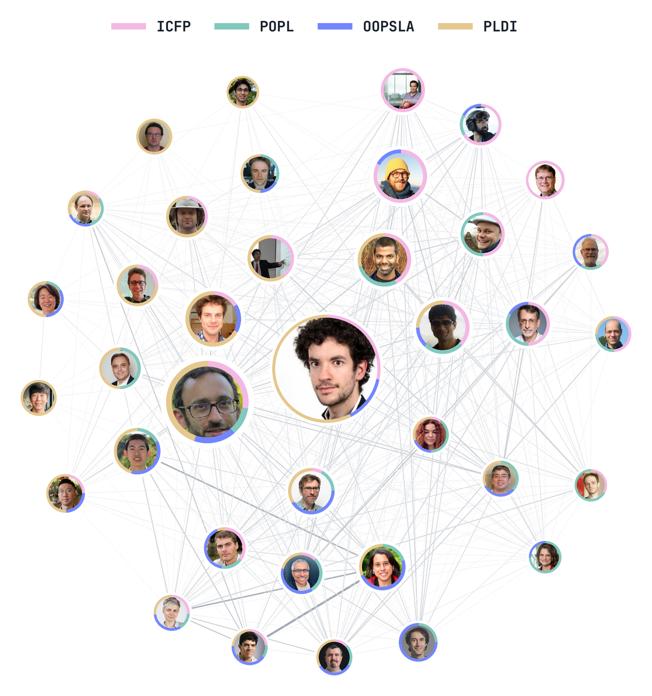

<p align="center">
  
</p>

# Program Committee Service and Citation Patterns

**Author:** Ender Sari

**Supervisor:** Clément Pit-Claudel

## Abstract
This project asks whether researchers are cited differently around the years when they serve on a program committee (PC). We build a researcher-conference-year panel that connects PC members, accepted papers, and OpenAlex data for selected programming languages conferences. Our results are descriptive: citation changes are small and uneven in the broader sample, but clearer for researchers with no earlier same conference service evidence. In that subset, citations to PC members' earlier work rise around the service year and then partly fade, while **the serving conference's citation share increases by about 9.2 percentage points before softening after the service year.** These patterns suggest citation movement around PC service, but not a causal effect.

-  [Final report](report.pdf)

-  [Exploratory project website](https://sariender.github.io/citemeifyoucan/)

- For questions about the data or reproducibility, please email me at `ender.sari@epfl.ch`.

### Project in Numbers

- Scope: `4` PL conferences: ICFP, POPL, OOPSLA, and PLDI, `2017-2025`.
- PC service data: `2,180` rows, covering `952` unique researchers.
- Accepted paper data: `2,528` papers.
- Citation graph input: `110,167` OpenAlex reference edges.
- Final panel: `37,128` researcher-conference-year rows.

## Repository Layout

```text
├── README.md
├── report.pdf
├── requirements.txt
├── project_setup.py
├── config/
│   ├── project_config.yaml
│   └── README.md
├── notebooks/
│   ├── step_1_pc_service_data/
│   ├── step_2_paper_citation_data/
│   ├── step_3_author_panel_data/
│   └── step_4_event_study/
├── step_1_data/              PC service data
│   ├── raw/
│   ├── intermediate/
│   └── prepared/
├── step_2_data/              accepted papers and OpenAlex references
│   ├── raw/
│   ├── intermediate/
│   └── prepared/
├── step_3_data/              author matching and final panel
│   ├── raw/
│   └── prepared/
├── step_4_data/              event window analysis rows
│   ├── raw/
│   └── prepared/
├── step_1_artifacts/         PC service checks
│   ├── figures/
│   ├── summary_tables/
│   ├── check_tables/
│   └── dependency_tables/
├── step_2_artifacts/         paper/reference checks
│   ├── figures/
│   ├── summary_tables/
│   ├── check_tables/
│   └── dependency_tables/
├── step_3_artifacts/         author matching checks
│   ├── figures/
│   ├── summary_tables/
│   └── check_tables/
├── step_4_artifacts/         analysis figures, tables, and method notes
│   ├── figures_t_minus_event_study/
│   ├── figures_citation_shift_event_study/
│   ├── main_text_figures/
│   └── summary_tables/
├── assets/
│   ├── repo_logo.png
│   └── validation_pdfs/
├── report_latex/             report figures
└── fonts/
```

## Pipeline

1. Step 1 builds the PC service data.
   - Data: `step_1_data/prepared/`
   - Main output: `step_1_data/prepared/pc_members.parquet`.
   - Service history check: `step_1_data/prepared/pc_first_service_evidence.parquet`.
   - Artifacts: `step_1_artifacts/`.

2. Step 2 builds the accepted paper and reference data.
   - Paper data: `step_2_data/prepared/all_papers/`
   - Main papers: `step_2_data/prepared/all_papers/all_papers_filtered.parquet`.
   - Reference edges: `step_2_data/intermediate/references/reference_edges.parquet`.
   - Cited author expanded references: `step_2_data/prepared/all_papers/all_ref_authors_exploded.parquet`.
   - Cached ACM front matter PDFs for title checks: `assets/validation_pdfs/`.

3. Step 3 links PC names to OpenAlex author identities and builds the panel.
   - Data: `step_3_data/prepared/`
   - Main panel: `step_3_data/prepared/panel.parquet`.
   - Feature panel: `step_3_data/prepared/panel_features.parquet`.
   - Matching: `step_3_data/prepared/pc_members_openalex_match.parquet`.

4. Step 4 builds the event window analysis data.
   - Data: `step_4_data/prepared/`
   - Citation level event study: `step_4_data/prepared/t_minus_2_reference_event_window_rows.parquet`.
   - Citation source analysis: `step_4_data/prepared/citation_source_shift_event_rows.parquet`.
   - Career age/visibility rows: `step_4_data/prepared/career_age_event_window_rows.parquet`.

## Main Data Files

| Step | File | Rows | Why it matters |
|---|---|---:|---|
| Step 1 | `step_1_data/prepared/pc_members.parquet` | 2,180 | Cleaned PC service rows. |
| Step 1 | `step_1_data/prepared/pc_first_service_evidence.parquet` | 1,496 | Earlier service history evidence. |
| Step 2 | `step_2_data/prepared/all_papers/all_papers_filtered.parquet` | 2,528 | Accepted papers used for citation counting. |
| Step 2 | `step_2_data/intermediate/references/reference_edges.parquet` | 110,167 | Reference edges from accepted papers to OpenAlex works. |
| Step 2 | `step_2_data/prepared/all_papers/all_ref_authors_exploded.parquet` | 355,366 | Reference edges expanded to cited authors. |
| Step 3 | `step_3_data/prepared/panel.parquet` | 37,128 | Final researcher-conference-year panel. |
| Step 3 | `step_3_data/prepared/panel_features.parquet` | 37,128 | Service history and analysis features. |
| Step 4 | `step_4_data/prepared/t_minus_2_reference_event_window_rows.parquet` | 2,015 | RQ1 event study rows. |
| Step 4 | `step_4_data/prepared/citation_source_shift_event_rows.parquet` | 1,500 | RQ2 citation source rows. |


## Final Panel Data Dictionary

`panel.parquet` keeps the minimal final panel data:

| Column | Meaning |
|---|---|
| `panel_row_id` | Row identifier. |
| `researcher_id` | Researcher identifier. |
| `name` | Researcher display name. |
| `conference` | Conference. |
| `year` | Conference year. |
| `pc_status` | `1` if the researcher is listed on the research paper PC for that conference year; otherwise `0`. |
| `citation_count` | References from accepted papers in that conference year to the researcher's earlier work. |

`panel_features.parquet` adds the variables used in checks and analysis:

- identity fields: `openalex_id`, ORCID fields, match_method,
  panel_identity_status, `citation_match_basis`;
- service history fields: first observed PC year, prior same conference service,
  and prior broad service evidence;
- citation variants: citation_count_no_self, citation_count_first_author,
  citation_count_first_or_last.

Join `panel.parquet` and `panel_features.parquet` on `panel_row_id`.

```python
import pandas as pd
from pathlib import Path

DATA = Path("step_3_data/prepared")

panel = pd.read_parquet(DATA / "panel.parquet")
features = pd.read_parquet(DATA / "panel_features.parquet")

panel_full = panel.merge(
    features.drop(columns=["researcher_id", "conference", "year"]),
    left_on="panel_row_id",
    right_on="panel_row_id",
    how="left",
    validate="one_to_one",
)
```

<!-- #region -->
## Manual Mapping and Validation

The most important manual/semimanual files are:

| File | Rows | What it records |
|---|---:|---|
| [`name_map_used_for_source_comparison.csv`](step_1_artifacts/dependency_tables/name_map_used_for_source_comparison.csv) | 128 | Name variants used when comparing PC list sources. |
| [`pc_researcher_identity_merges.csv`](step_1_artifacts/dependency_tables/pc_researcher_identity_merges.csv) | 6 | Duplicate profile merges for PC researchers. |
| `step_3_data/prepared/pc_members_openalex_match.parquet` | 952 | OpenAlex/ORCID match status for each PC researcher. |
| [`manual_selection.csv`](step_3_artifacts/check_tables/manual_update/manual_selection.csv) | 522 | Manual author candidate review decisions. |
| [`researchers_matched_how.csv`](step_3_artifacts/summary_tables/researchers_matched_how.csv) | 952 | How each PC researcher is counted in the final panel. |

Key matching numbers:

- `793` of `952` PC researchers match exactly to one OpenAlex author ID.
- Citation outcomes can be constructed for `942` of `952` PC researchers.
- `10` PC researchers remain unresolved for citation counting.

## Notebooks for Figures and Tables

**Step 1: PC service checks**  
Base path: `notebooks/step_1_pc_service_data/`

- [`04_compare_hotcrp_researchr_sources.ipynb`](notebooks/step_1_pc_service_data/04_compare_hotcrp_researchr_sources.ipynb)
- [`05_pc_members_bar_chart_breakdown.ipynb`](notebooks/step_1_pc_service_data/05_pc_members_bar_chart_breakdown.ipynb)
- [`06_build_pc_members.ipynb`](notebooks/step_1_pc_service_data/06_build_pc_members.ipynb)
- [`07_true_first_pc_service.ipynb`](notebooks/step_1_pc_service_data/07_true_first_pc_service.ipynb)
- [`08_pc_service_overlap_plots.ipynb`](notebooks/step_1_pc_service_data/08_pc_service_overlap_plots.ipynb)

**Step 2: Paper and OpenAlex checks**  
Base path: `notebooks/step_2_paper_citation_data/`

- [`02_title_checks.ipynb`](notebooks/step_2_paper_citation_data/02_title_checks.ipynb)
- [`03_paper_counts_plot.ipynb`](notebooks/step_2_paper_citation_data/03_paper_counts_plot.ipynb)
- [`05_reference_check_plots.ipynb`](notebooks/step_2_paper_citation_data/05_reference_check_plots.ipynb)

**Step 3: Author matching and panel checks**  
Base path: `notebooks/step_3_author_panel_data/`

- [`01_match_pc_members_to_openalex.ipynb`](notebooks/step_3_author_panel_data/01_match_pc_members_to_openalex.ipynb)
- [`02_build_identity_validation_table.ipynb`](notebooks/step_3_author_panel_data/02_build_identity_validation_table.ipynb)
- [`03_review_unmatched_name_candidates.ipynb`](notebooks/step_3_author_panel_data/03_review_unmatched_name_candidates.ipynb)
- [`04_build_panel.ipynb`](notebooks/step_3_author_panel_data/04_build_panel.ipynb)
- [`05_cohort1_zero_share_plot.ipynb`](notebooks/step_3_author_panel_data/05_cohort1_zero_share_plot.ipynb)

**Step 4: Event study and citation source figures**  
Base path: `notebooks/step_4_event_study/`

- [`01_career_age_event_study.ipynb`](notebooks/step_4_event_study/01_career_age_event_study.ipynb)
- [`02_citation_source_shift_extension.ipynb`](notebooks/step_4_event_study/02_citation_source_shift_extension.ipynb)
- [`03_t_minus_2_reference_event_study.ipynb`](notebooks/step_4_event_study/03_t_minus_2_reference_event_study.ipynb)
- [`04_selected_source_share_analysis.ipynb`](notebooks/step_4_event_study/04_selected_source_share_analysis.ipynb)
- [`04_t_minus_conference_comparison.ipynb`](notebooks/step_4_event_study/04_t_minus_conference_comparison.ipynb)
- [`05_selected_source_share_trace_audit.ipynb`](notebooks/step_4_event_study/05_selected_source_share_trace_audit.ipynb)
- [`06_t_minus_pooled_conference_breakdowns.ipynb`](notebooks/step_4_event_study/06_t_minus_pooled_conference_breakdowns.ipynb)

## Raw Fetch Notebooks

These notebooks build the cached Step 1 and Step 2 inputs.  
*They are not needed when reproducing figures and tables.*

**Step 1: Raw PC service fetches**  
Base path: `notebooks/step_1_pc_service_data/`

- [`01_fetch_hotcrp_members.ipynb`](notebooks/step_1_pc_service_data/01_fetch_hotcrp_members.ipynb)
- [`02_fetch_researchr_pc_members.ipynb`](notebooks/step_1_pc_service_data/02_fetch_researchr_pc_members.ipynb)
- [`03_fetch_researchr_external_members.ipynb`](notebooks/step_1_pc_service_data/03_fetch_researchr_external_members.ipynb)

**Step 2: Raw OpenAlex fetches**  
Base path: `notebooks/step_2_paper_citation_data/`

- [`01_fetch_papers.ipynb`](notebooks/step_2_paper_citation_data/01_fetch_papers.ipynb)
- [`04_fetch_reference_authors.ipynb`](notebooks/step_2_paper_citation_data/04_fetch_reference_authors.ipynb)


## What Is Not Included

- Researchr screenshot assets;
- Raw website snapshots;
- Raw OpenAlex JSON caches;
- Previous experiments.
  
## Notes

- OpenAlex metadata changes over time; this project uses citation metadata cached on June 11, 2026.
- The included cached data are enough to reproduce the main tables, statistics, and regenerated analysis artifacts.
<!-- #endregion -->
